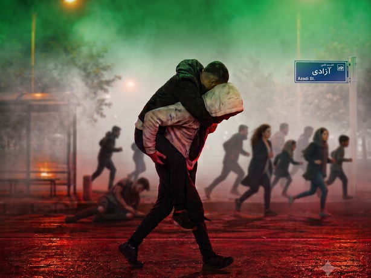

## 🕊️ میراثی برایِ «عزیزان»

> **سلام به شما، ای کوه‌هایِ صبر و ای صاحبانِ دردهایِ بیصدا؛**

من به عنوان سازنده‌ی پلتفرم **«ایران من»**، امروز با زبانِ لرزانِ قلبم با شما حرف می‌زنم. می‌دانم که در خلوتِ خود، وقتی به جایِ خالیِ مادر، پدر، خواهر، برادر یا فرزندتان نگاه می‌کنید، شاید این سوالِ تلخ از ذهنتان بگذرد که: *«آیا خونِ عزیزِ من بیهوده ریخته شد؟»*

**نه! نمیتوانیم اجازه دهیم خون عزیزان ما بیهوده ریخته شود!**

عزیزانِ شما بیهوده نرفتند. آن‌ها نرفتند که فقط نامشان رویِ برگ‌های تاریخ بماند؛ آن‌ها رفتند تا راهی را باز کنند تا یک **«ایرانِ بدونِ ظلم و ستمگر و غارتگر»** را به واقعیت تبدیل کنیم. امروز این برنامه وجود دارد که لرزه بر اندامِ مفسدان و دزدان بیاندازد، همه‌اش به خاطرِ آن شجاعتِ بی‌مرز «عزیزانِ شما» است. آن‌ها بذرِ این عدالت را با جانشان کاشتند و ما حالا وظیفه داریم از این جوانه محافظت کنیم.

می‌خواهم بدانید که چنین ابزاری امروز وجود دارد. **«ایران من»** ساخته شده تا پایانی باشد بر عصرِ تاریکی. این پلتفرم طراحی شده تا راهِ نفسِ فاسدان را ببندد، تا اتاق‌های این کشور را شیشه‌ای و روشن کند و اجازه ندهد حتی یک ریال از ثروتِ این مردم، دور از چشمِ صاحبانِ اصلی‌اش، جابه‌جا شود. این همان سیستمی است که در آن مسئولین دیگر «ارباب» نیستند، بلکه خدمتگزارانی هستند که تحتِ نظارتِ مستقیمِ شما قرار دارند.

ما می‌دانیم که غارتگران و ظالمان که از تاریکی نفع می‌برند، با تمامِ قوا خواهند ایستاد و مانع‌تراشی خواهند کرد. آن‌ها از این شفافیت می‌ترسند، چون می‌دانند با این ابزار، **«ما این کشور را پس می‌گیریم»** و از نو می‌سازیم.

این برنامه میراثِ خونِ پاکِ عزیزانِ شماست. بگذارید همه بدانند که دورانِ غارتگران و ظالمان تمام شده است. ما با تکیه بر حقِ شما و به حرمتِ آن لبخندهایی که نیمه‌تمام ماند، خانه‌ای خواهیم ساخت که در آن عدالت مثل خورشید بتابد. تا رسیدن به آن ایرانی که آن‌ها آرزویش را داشتند، از پای نخواهیم نشست.

*آرام بخوابید ای ستارگانِ درخشانِ ما، که ما بیداریم.*
